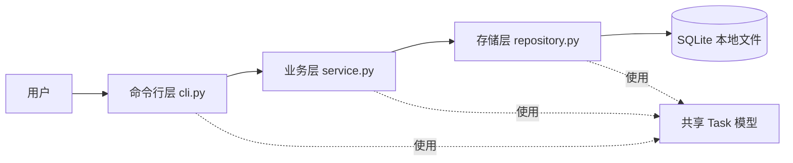
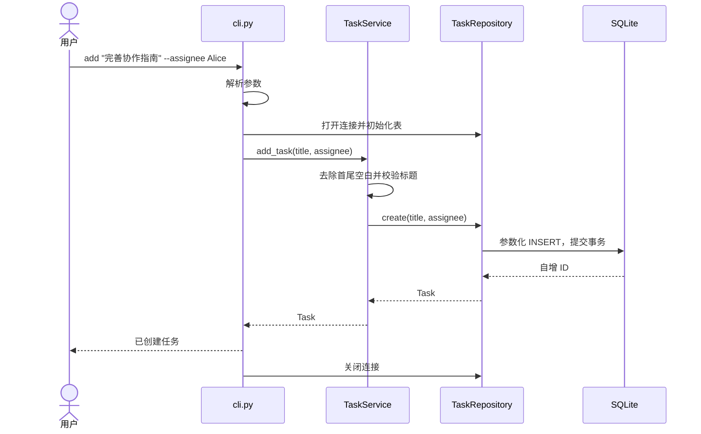
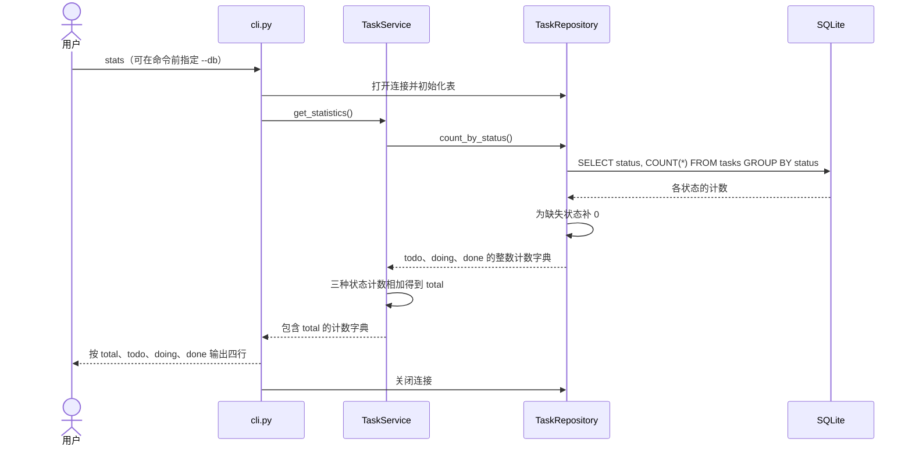

# 架构设计

## 分层与依赖

| 模块 | 职责 | 主要接口 |
| --- | --- | --- |
| `team_tasks/__main__.py` | 模块启动入口，返回进程退出码 | 调用 `main()` |
| `team_tasks/cli.py` | 解析参数、组装依赖、格式化输出、映射错误 | `build_parser()`、`main(argv)` |
| `team_tasks/service.py` | 校验标题、负责人、状态、ID，组织业务操作及计算任务总数 | `TaskService`、`get_statistics()` |
| `team_tasks/repository.py` | 创建表、参数化 SQL、按状态聚合、事务和连接生命周期 | `TaskRepository`、`count_by_status()` |
| `team_tasks/models.py` | 各层共享的不可变任务数据 | `Task`、`STATUSES` |
| `team_tasks/errors.py` | 可预期的应用错误类型 | `TaskError` 及其子类 |

业务层通过构造参数接收仓库对象。当前只有一个 SQLite 实现，直接使用具体类，避免为小项目增加抽象基类、框架或依赖注入容器。若将来增加其他存储方式，再引入协议接口。

## 创建任务的数据流

参数解析在连接数据库前完成，因此 `--help`、未知命令、无效 ID 或缺少更新字段不会创建数据库。业务校验在存储初始化后进行，因此空标题等业务错误可能留下空数据库，但不会插入无效任务。

## 状态统计的数据流

统计使用一次 SQL 聚合，不加载全部任务，也不修改已有任务数据。`total` 从同一次查询的三项计数求和。命令行只负责按固定顺序展示结果，不编写 SQL；初始化及查询失败沿用 `StorageError` 的处理流程。`stats` 没有筛选参数，无需改变 `Task` 模型或表结构。

## 数据模型

`Task` 使用 `@dataclass(frozen=True)`，由 `id`、`title`、`assignee`、`status` 四个字段组成；修改操作返回新的对象。

| SQLite 字段 | 定义 | 业务含义 |
| --- | --- | --- |
| `id` | `INTEGER PRIMARY KEY AUTOINCREMENT` | 唯一任务 ID，删除后不复用 |
| `title` | `TEXT NOT NULL`，非空检查 | 去除首尾空白后的标题 |
| `assignee` | 可空 `TEXT` | 负责人，`NULL` 表示未分配 |
| `status` | `TEXT NOT NULL DEFAULT 'todo'`，枚举检查 | `todo`、`doing`、`done` |

首次打开自动创建父目录及 `tasks` 表。所有写操作使用事务，SQL 值通过 `?` 参数绑定；任务记录转换为 `Task`，状态聚合结果转换为整数计数字典。未匹配筛选条件返回空列表，读取不存在的 ID 返回 `None`。

业务层把不存在记录转为 `TaskNotFoundError`。标题等输入在调用写操作前完成校验，避免只保存一部分字段。数据库约束提供第二道校验，写入失败时事务回滚。

## 连接与错误处理

- 命令行通过 `with TaskRepository(...)` 管理连接，每次命令结束后关闭；数据保存在同一个 SQLite 文件中。
- 业务错误使用 `ValidationError`、`TaskNotFoundError`；文件系统及 SQLite 错误转为 `StorageError`。它们都继承 `TaskError`。
- 命令行只捕获已知 `TaskError`，向标准错误输出说明并返回 1；参数解析错误由 `argparse` 返回 2。意外编程错误保留调用栈以便排查。
- 无效数据库文件不会被自动删除或替换。用户可核对路径，或使用 `--db` 指定新文件。
- 数据库只用于每位成员的本地练习；跨进程顺序访问有测试，不提供跨机器共享数据库或并发业务更新保证。

## 技术选择与扩展位置

| 选择 | 理由与边界 |
| --- | --- |
| `argparse` | Python 自带，提供帮助、子命令和参数错误处理 |
| SQLite | Python 自带驱动，有事务和查询能力，无需启动数据库服务 |
| `unittest` | Python 自带，适合单元测试、临时库测试及子进程测试 |
| 根目录 Python 包 | 可直接 `python -m team_tasks`，无需先安装或打包 |
| 中文 Markdown + Mermaid | 代码和文档一起评审，可在 GitHub 查看图表 |

A 的 JSON 输出扩展命令行展示；B 的状态统计从存储聚合、业务接口贯通到新增命令。两项练习均已实现，复用当前数据模型和数据库表。
